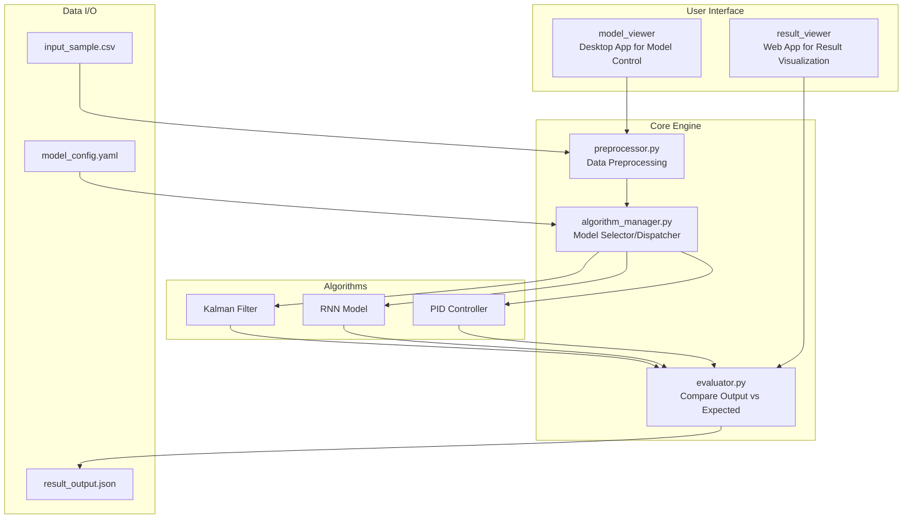

# Simulation and Verification Environment

## System structure and Data flow diagram

```mermaid
graph TD
  subgraph User Interface
    A1[model_viewer<br/>Desktop App for Model Control]
    A2[result_viewer<br/>Web App for Result Visualization]
  end

  subgraph Core Engine
    B1[preprocessor.py<br/>Data Preprocessing]
    B2[algorithm_manager.py<br/>Model Selector/Dispatcher]
    B3[evaluator.py<br/>Compare Output vs Expected]
  end

  subgraph Algorithms
    C1[Kalman Filter]
    C2[RNN Model]
    C3[PID Controller]
  end

  subgraph Data I/O
    D1[input_sample.csv]
    D2[model_config.yaml]
    D3[result_output.json]
  end

  A1 --> B1
  A2 --> B3
  B1 --> B2
  B2 --> C1
  B2 --> C2
  B2 --> C3
  C1 --> B3
  C2 --> B3
  C3 --> B3
  D1 --> B1
  D2 --> B2
  B3 --> D3

```