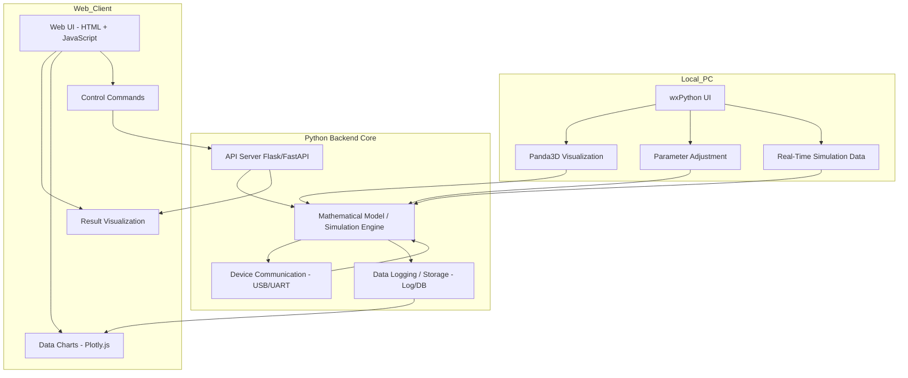

# robot_arm_motion

## System structure and Data flow diagram

```mermaid
graph TD
    subgraph Local_PC
        A1[wxPython UI]
        A2[Panda3D Visualization]
        A3[Parameter Adjustment]
        A4[Real-Time Simulation Data]
    end

    subgraph Backend_Core[Python Backend Core]
        B1[Mathematical Model / Simulation Engine]
        B2[Device Communication - USB/UART]
        B3[Data Logging / Storage - Log/DB]
        B4[API Server Flask/FastAPI]
    end

    subgraph Web_Client
        C1[Web UI - HTML + JavaScript]
        C2[Result Visualization]
        C3[Data Charts - Plotly.js]
        C4[Control Commands]
    end

    %% Connections
    A1 --> A2
    A1 --> A3
    A1 --> A4
    A3 --> B1
    A2 --> B1
    A4 --> B1

    C1 --> C2
    C1 --> C3
    C1 --> C4

    B1 --> B2
    B2 --> B1
    B1 --> B3
    B3 --> C3

    C4 --> B4
    B4 --> B1
    B4 --> C2
```