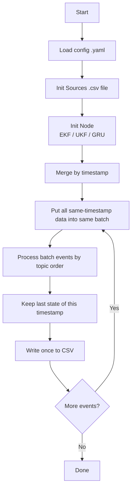

# masv-platform - Modular Autonomy Simulation & Validation Platform — Sensor Fusion & ML (ROS2 + Local Runner)

**MASV** is a modular toolkit for testing and comparing sensor-fusion and ML algorithms with **ROS2** or a **lightweight local runner** (no ROS2).
Use ROS2 for live systems and integration; use the local runner for quick offline experiments on CSV logs. Switch between them without changing algorithms.

**Algorithms included**

* **EKF** (Extended Kalman Filter)
* **UKF** (Unscented Kalman Filter)
* **GRU** (ONNX inference on 6-D IMU sequences)

**What you get**

* **ROS2 workflow**: nodes, params (YAML), topics (`/imu`, `/gnss`, `/mag`), and a containerized setup.
* **Local runner**: single `main.py` + YAML, same algorithms, same configs; batch-safe same-timestamp handling; CSV in/out.
* **Viewers**: model viewer (wxPython) and result viewer for quick inspection.
* **CI hooks**: smoke tests on simulated data.

**What this README covers**

* Running the ROS2 and docker/local simulation pipeline (EKF / UKF / GRU) with YAML + BAG/CSV.

**Looking for something eles?**

- ROS2 Detail (containerized with docker): coming soon
- CI (GitHub Actions): coming soon
- Model Viewer (wxPython): coming soon
- Result Viewer: coming soon
- Algorithm details (EKF/UKF/GRU): coming soon

---

## Two ways to run (pick what you need)

**1) ROS2 (recommended for integration & real time)**

* Launch the EKF/UKF/GRU nodes with ROS2 parameter files.
* Reuse the same algorithm cores as the local runner.

**2) Local runner (fast offline on CSV)**

* Keep your CSV headers; map via YAML (`rename` / `map_*`).
* One predict per timestamp; other same-time measurements are update-only.
* Outputs to `outputs/state_*.csv`.

```bash
# create env from environment.yml
conda env create -f environment.yml
conda activate mod_ai_svp

# run
python main.py --config configs/run_ekf.yaml
python main.py --config configs/run_ukf.yaml
python main.py --config configs/run_gru.yaml

```

Outputs go to `data/simple_outputs/state_*.csv` with columns like `timestamp,x,y,yaw,...`.

---
## ROS2 + Docker (Quick Start)

This section is the **quick start** for the Docker path.

--

### Prerequisites

* Docker Desktop (macOS/Windows) or Docker Engine (Linux)
* Docker Desktop → *Settings → Resources → File Sharing* includes your project path (macOS)

--

### Directory layout (key paths)

```
project/
├─ docker/                # Dockerfile, docker-compose.yml, .env
├─ ros2_ws/               # ROS 2 workspace (src/ros2_interface/…)
└─ data/
   ├─ rosbag_logs/        # rosbag2 datasets  (BAG_DIR)
   └─ analysis/           # analysis outputs (CSV/PNG)
```
--
### Environment (.env and `docker-compose.yml` same folder)

```env
BAG_DIR=/root/data/rosbag_logs
ANALYSIS_DIR=/root/data/analysis
ROS_DOMAIN_ID=0
RMW_IMPLEMENTATION=rmw_fastrtps_cpp
TZ=America/New_York
```
--
### Start the container


```bash
cd $path_to_project/docker
docker compose build
docker compose up -d
docker exec -it ros2-dev-container bash
```
--
#### First-time workspace setup (inside the container)

```bash
# Source ROS and build the workspace once
source /opt/ros/humble/setup.bash
cd ~/ros2_ws
colcon build --symlink-install

# Make the built packages available in this shell
source install/setup.bash
```
Tip: added auto-source
```bash

source /opt/ros/humble/setup.bash
[ -f ~/ros2_ws/install/setup.bash ] && source ~/ros2_ws/install/setup.bash

```
--
### Play a bag (recommended)

```bash
# Option A: from launch (if your launch supports bag args)
ros2 launch ros2_interface simulation_launch.py \
  use_log_replay:=false play_bag:=true \
  bag:="$BAG_DIR/<bag_folder>" use_sim_time:=true

# Option B: split terminals
ros2 launch ros2_interface simulation_launch.py
# in another terminal:
ros2 bag play "$BAG_DIR/<bag_folder>" -l --clock
```

> Point `bag` to the **folder** containing `metadata.yaml` (+ `*.db3`/`*.mcap`).
--
### Record a quick bag

```bash
mkdir -p "$BAG_DIR"
ros2 bag record /imu/data -o "$BAG_DIR/imu_$(date +%F_%H%M)"
ros2 bag info "$BAG_DIR"/imu_*
```
--
### Inspect topics

```bash
ros2 topic list -t
ros2 topic echo /imu/data
ros2 topic hz /imu/data
```
--
### QoS gotcha (most common)

If you see:

```
New publisher discovered ... incompatible QoS (RELIABILITY)
```

Make subscriber(s) use **sensor QoS** (best-effort, volatile).
--
### Optional: basic analysis & Flask

* Write CSV/PNG to `ANALYSIS_DIR` from an analysis node.
* Serve quick plots inside the same container (port 5000 exposed):

```bash
export ANALYSIS_DIR=/root/data/analysis
python3 /root/result_viewer/app.py  # app.run(host="0.0.0.0", port=5000)
# Open http://localhost:5000 in brewser
```
--
### Troubleshooting (quick)

* **Pull access denied for `local/ros2-dev`** → `docker compose build` first, or remove `image:` and rely on `build:`.
* **Mounts denied / path not shared** → Add your project path in Docker Desktop File Sharing.
* **`python: command not found`** → Use `python3`/`pip3` (or install `python-is-python3` in the image).
* **Bag path points to a `.db3` file** → Pass the **bag folder** (with `metadata.yaml`).

---
## Local Runner

### How `main.py` works

1. **Sources**: read CSV(s), apply optional `rename`, yield events `{"_topic": "...", "timestamp": t, ...}`.
2. **Merge**: k-way merge by timestamp across sources.
3. **Batching**: group **same-timestamp** events and process in fixed order (default **IMU -> GNSS -> MAG**).

   * One **predict** per timestamp; other same-time events are **update** only.
   * Writer policy: **write once per timestamp** (last state of that time).
4. **Node**: call `node.on_event(ev)`; nodes implement:

   ```python
   class BaseNode:
       def reset(self) -> None: ...
       def on_event(self, ev: dict) -> dict | None: ...
   ```
5. **Sink**: write returned dict to CSV.

---

### Data format (for local runner)

* IMU: `timestamp_sec, accel_x_mps2, accel_y_mps2, accel_z_mps2, gyro_x_radps, gyro_y_radps, gyro_z_radps`
* MAG: `timestamp_sec, mag_x_uT, mag_y_uT, mag_z_uT`
* GNSS: `timestamp_sec, gnss_lat_deg, gnss_lon_deg, gnss_alt_m`
  Units: accel **m/s²**, gyro **rad/s**, lat/lon in **deg** (converted to meters internally).

---

### Minimal UKF config (example)


```yaml
sources:
  - type: csv
    params:
      path: $your_imu_csv_data
      ts_col: timestamp_sec
      topic: imu
      rename: { gyro_z_radps: wz }     # optional header mapping
  - type: csv
    params:
      path: $your_gnss_csv_data
      ts_col: timestamp_sec
      topic: gnss
      rename: { gnss_lat_deg: lat, gnss_lon_deg: lon }
  - type: csv
    params:
      path: $your_mag_csv_data
      ts_col: timestamp_sec
      topic: mag
      rename: { mag_x_uT: mx, mag_y_uT: my }

node:
  type: plugins.algos.ukf_node.UKFNode   # dotted path to your node class
  params:
    Q: [[0.01,0,0],[0,0.01,0],[0,0,0.001]]
    R_gnss: [[1,0],[0,1]]
    R_mag: [[0.05]]

sink:
  type: plugins.csv_sink.CsvSink
  params:
    path: data/simple_outputs/state_ukf.csv

options:
  realtime: false   # replay with wall-clock pacing if true
```

---

### Flowchart


---

### How things stay consistent

* The **same EKF/UKF/GRU cores** power both ROS2 nodes and the local runner.
* Local runner batches same-timestamp events in a fixed order (default **IMU -> GNSS -> MAG**) and **writes once per timestamp**.

---

### Switching algorithms

Change the node dotted path in YAML:

* EKF: `plugins.algos.ekf_node.EKFNode`
* UKF: `plugins.algos.ukf_node.UKFNode`
* GRU: `plugins.algos.gru_node.GRUNode` (expects `[ax,ay,az,gx,gy,gz]` window; set `onnx_path`, `seq_len`)

No changes to `main.py` required.

---

### Simulated data (optional)

Use a small script to generate:

* `data/sample_inputs/imu.csv` (e.g., 50 Hz), `data/sample_inputs/mag.csv` (10 Hz), `data/sample_inputs/gnss.csv` (1 Hz), 10 s arc motion.
  This is handy for smoke tests and CI.

---

### Extending

* Add a new node in `plugins/algos/new_node.py` implementing `reset` and `on_event`.
* Point YAML `new_node.type` to `plugins.algos.new_node.NewNode`.
* Add new sources/sinks by mirroring `csv_source.py` / `csv_sink.py`.


---

### Troubleshooting

- In progress

---

## Acknowledgment

The dataset used in this project (`utbm_robocar_dataset_20190110_noimage.bag`) was kindly provided by the **Université de Technologie de Belfort-Montbéliard (UTBM)** as part of the [UTBM Robocar Dataset](https://github.com/rwth-asic/utbm_robocar_dataset). 

We thank the UTBM team for their contribution to the open-source robotics and autonomous driving research community.
